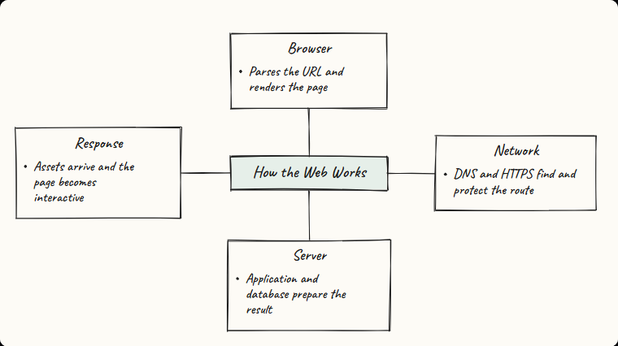
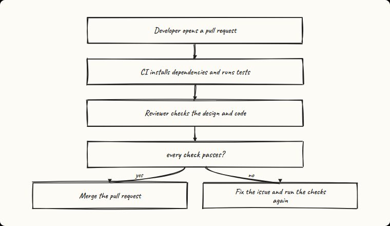
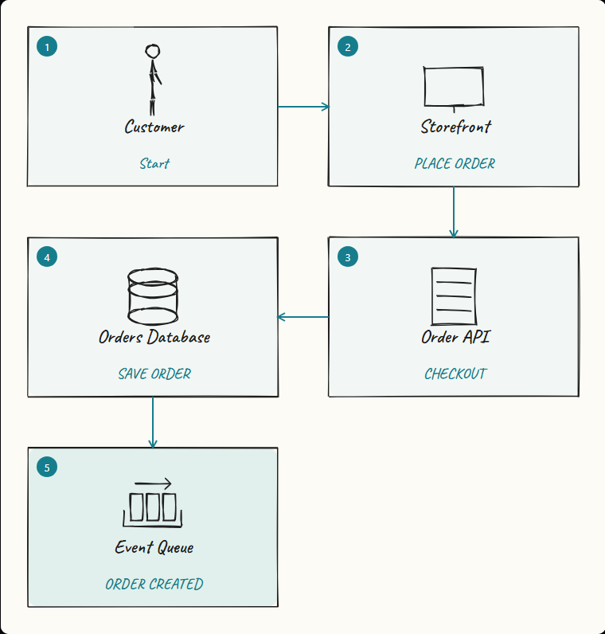
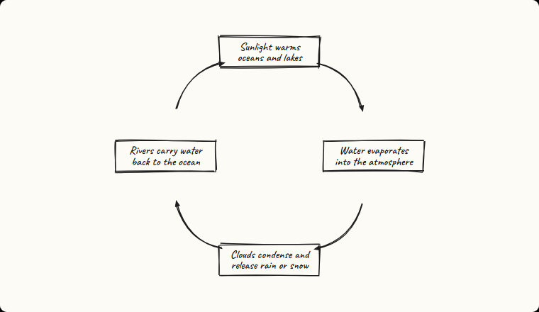
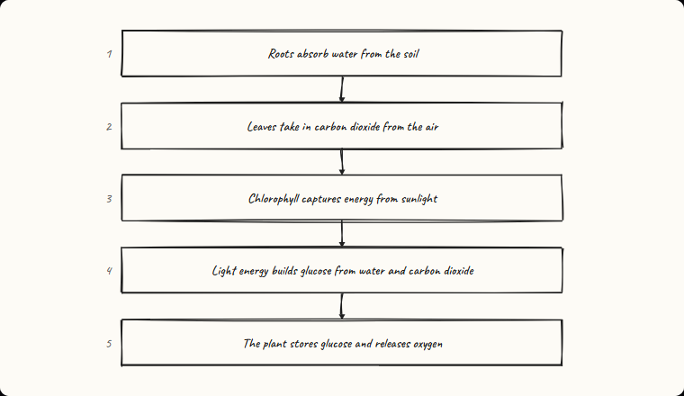
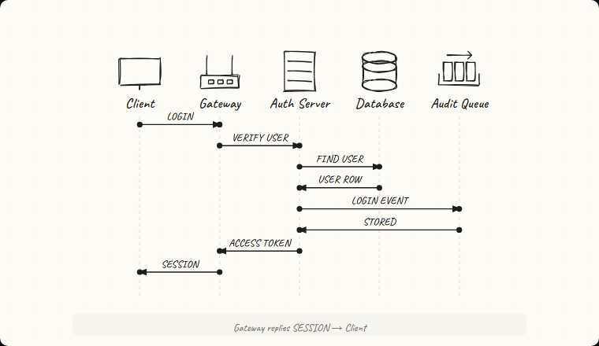
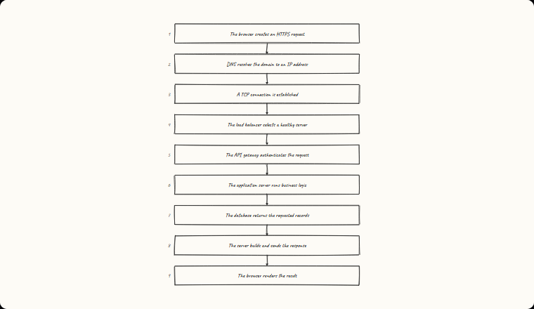

# LDOC showcase

Seven small examples demonstrate the visual language without AI. Open any `.ldoc`
file in VS Code to watch it animate. Use **LDOC: Export to HTML** when you want a
standalone offline animation.

## Mind map — How the Web Works

[Source](mindmap.ldoc)

## Flow chart — Pull Request Quality Gate

[Source](flow-chart.ldoc)

## System flow — What Happens After You Click Buy?

[Source](system-flow.ldoc)

## Science — The Water Cycle

[Source](water-cycle.ldoc)

## Science process — Photosynthesis

[Source](photosynthesis.ldoc)

## Architecture — Distributed Login

[Source](distributed-system.ldoc)

## Camera movement — Follow a Web Request

[Source](camera-journey.ldoc)

The PNGs work in GitHub README files and social posts. The `.ldoc` files are the
editable source.
